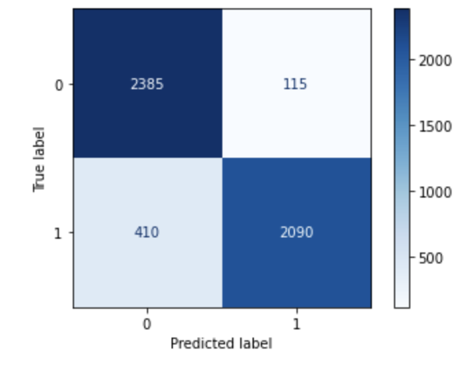
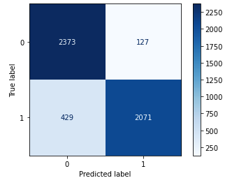

# Project 3

---
# Subreddit classification model

## Context
The add agency where I recently started working is the new kid in the block in it’s old but quickly changing industry. Trying to pioneer the space and stay ahead of the curve, they have built a Data Science team.
Regarding the marketing industry, about four out of ten dollars invested in ads in the country were devoted to digital advertising, and the projection is that this rate is only going to keep increasing.

## Problem statement
My boss has asked me  to build a model that is able to classify between two subreddit posts. This model will be used to proof to our clients that we are able to be super specific and are able to very accurately target the best placement for their adds. Because clients can sometimes be very demanding this model should be as dynamic as it can be.

## Description of data
For this project, Pushshift's API is being used to collect posts from two subreddits: r/CryptoMarkets and r/Economics. [`crypto.csv`](./data/crypto.csv) and [`economics.csv`](./data/economics.csv) are both the first raw collection of data from each subreddit whereas [`sub-crypto.csv`](./data/sub-crypto.csv) and [`sub-economics.csv`](./data/sub-economics.csv) are both data sets containing a target column (subreddit name) and a feeature column (post titles).

1. [`crypto.csv`](./data/crypto.csv):
This data set contains 10000 rows and 85 columns.

2. [`economics.csv`](./data/economics.csv):
This data set contains 10000 rows and 83 columns.

3. [`sub-crypto.csv`](./data/sub-crypto.csv):
This data set contains 10000 rows and 2 columns. A target and feature column.

| Feature       | Type   | Description                 |
|---------------|--------|-----------------------------|
| subreddit     | string |    Name of subreddit        |   
| title         | string |    Title of each post       |  

4. [`sub-economics.csv`](./data/sub-economics.csv):
This data set contains 10000 rows and 2 columns. A target and feature column.

| Feature       | Type   | Description                 |
|---------------|--------|-----------------------------|
| subreddit     | string |    Name of subreddit        |   
| title         | string |    Title of each post       |  

## Data Analysis

1. **Data cleaning:**
Because this model is interested in classifying subreddit posts by their title, every charachter is important. After checking for null values, the data cleaning process is done.

2. **EDA and visualization:**
In this section, the data will be analyzed for an overview study of the data sets.

First, a column with the length of each post and another one with the word count was created. This will allow for further analysis due to before only having categorical variables.

I conducted some summary statistics for each data frame to scan for some significant insights. Some interesting observations would be:
    - Length and word count from both subreddit posts are very similar
    - Both subreddit don't have very long post titles

 

Then, I plotet both subreddit character and word count distributions:

 

As shown by the graphs, both subreddits have similar distributions and scores. The fact that they are right skewed isn't really relevant. It just indicates that posts don't have very long titles.

Finally, I proceeded to vectorize the data for each data frame so I could plot the top used words in each subreddit:

    1. Raw data:
       We can observe lots of common words due to them being english prepositions, determiners, articles, etc.
       
   
       
    2. 'English' stop_words:
       After excluding very common english words such as articles and so, we can see very little common words between both subreddits.
    
   
   
    3. 'English' stop_words & bigrams:
       After excluding very common english words and looking for bigrams, both subreddits have no more common words (bigrams).

   
   

## Models

#### 1.**SVM (Support vector machine) model:**
Two Support Vector Machine classication models will be developed. First, text data will be converted into a structured numeric dataframe using Countvectorizer and then TF-IDF Vectorizer.

1. **Importing and loading data:**
First, I imported the needed libraries and loaded the cleaned data we prepared earlier. To be able to conduct the study, both data frames are merged together.

2. **Feature engineering:**
Once the data frames were merged together, the subreddit column was one hot encoded and rows were shuffled.

3. **Defining matrixes:**
A feature matrix containing the 'title' column and a target column containing the one hot encoded 'subreddit' column were created.

4. **Model instantiation and performance measurement using CountVectorizer:**

- Data was Train/Test splitted and using CountVectorizer with 'english' stopwords and bigrams, data was vectorized.
- Instantiating and fitting SVM
- Measuring performance: accuracy score very overfitted and with a test score of 0.70
- Gridsearching to optimize performance: still very overfitted but test score increase up to 0.78

5. **Model instantiation and performance measurement using TF-IDF Vectorizer:**

- Data was Train/Test splitted and using TF-IDF Vectorizer with 'english' stopwords, unigrams and bigrams, data was vectorized.
- Instantiating and fitting SVM using Gridsearch for model optimization
- Measuring performance: accuracy score overfitted and with a test score of 0.91.
- Calculated and plottet a confusion matrix and a ROC AUC curve.

 

Because of the problem statement, there is no difference regarding interest between sensitivity or specificity. ROC AUC curve and score is the more interesting metric, due to this curve helping us visualize our tradeoff between sensitivity and specificity and understand how well-separated our populations are.

#### 2.**Multinomial Naive Bayes model:**
A Multinomial Naive Bayes model will be developed. The text data will be converted into a structured numeric dataframe using TF-IDF Vectorizer.

1. **Importing and loading data:**
First, I imported the needed libraries and loaded the cleaned data we prepared earlier. To be able to conduct the study, both data frames are merged together.

2. **Feature engineering:**
Once the data frames were merged together, the subreddit column was one hot encoded and rows were shuffled.

3. **Defining matrixes:**
A feature matrix containing the 'title' column and a target column containing the one hot encoded 'subreddit' column were created.

4. **Model instantiation and performance measurement using CountVectorizer:**

- Data was Train/Test splitted and using CountVectorizer with 'english' stopwords, unigrams and bigrams, data was vectorized.
- Instantiating and fitting the Multinomial Naive Bayes model.
- Gridsearching to optimize performance: overfitted with accuracy test score of 0.909.
- Calculated and plottet a confusion matrix and a ROC AUC curve.

 

5. **Model instantiation and performance measurement using TF-IDF Vectorizer:**

- Data was Train/Test splitted and using TF-IDF Vectorizer with 'english' stopwords, unigrams and bigrams, data was vectorized.
- Instantiating and fitting the Multinomial Naive Bayes model.
- Gridsearching to optimize performance: overfitted with accuracy test score of 0.901.
- Calculated and plottet a confusion matrix and a ROC AUC curve.

 

As before stated, because of the problem statement, there is no difference regarding interest between sensitivity or specificity. ROC AUC curve and score is the more interesting metric, due to this curve helping us visualize our tradeoff between sensitivity and specificity and understand how well-separated our populations are.

#### 3.**Random Forest model:**
A Random Forest model will be developed. The text data will be converted into a structured numeric dataframe using TF-IDF Vectorizer.

1. **Importing and loading data:**
First, I imported the needed libraries and loaded the cleaned data we prepared earlier. To be able to conduct the study, both data frames are merged together.

2. **Feature engineering:**
Once the data frames were merged together, the subreddit column was one hot encoded and rows were shuffled.

3. **Defining matrixes:**
A feature matrix containing the 'title' column and a target column containing the one hot encoded 'subreddit' column were created.

4. **Model instantiation and performance measurement using CountVectorizer:**

- Data was Train/Test splitted and using TF-IDF Vectorizer with 'english' stopwords, unigrams and bigrams, data was vectorized.
- Instantiating and fitting the Random Forest model.
- Gridsearching to optimize performance: overfitted with accuracy val score of 0.895
- Calculated and plottet a confusion matrix and a ROC AUC curve.

 

5. **Model instantiation and performance measurement using TF-IDF Vectorizer:**

- Data was Train/Test splitted and using TF-IDF Vectorizer with 'english' stopwords, unigrams and bigrams, data was vectorized.
- Instantiating and fitting the Random Forest model.
- Gridsearching to optimize performance: overfitted with accuracy val score of 0.888
- Calculated and plottet a confusion matrix and a ROC AUC curve.

 

As before stated, because of the problem statement, there is no difference regarding interest between sensitivity or specificity. ROC AUC curve and score is the more interesting metric, due to this curve helping us visualize our tradeoff between sensitivity and specificity and understand how well-separated our populations are.

---
## Conclusion and recommendations

First, let's go back to the objective of this project which was to create a dynamic model that can accuretaly classify a subreddit post. After measuring performance of various models, I conclude that the model that best fits the objective is the **Multinomial Naive Bayes, using CountVectorizer** as a data vectorizer, due to performing very good but also due to it's immediate response. Both other models are much more time consuming.

As a recomendation, I would suggest trying a boosting algorithm like AdaBoost to see if it reduces variance without significantly affecting accuracy.